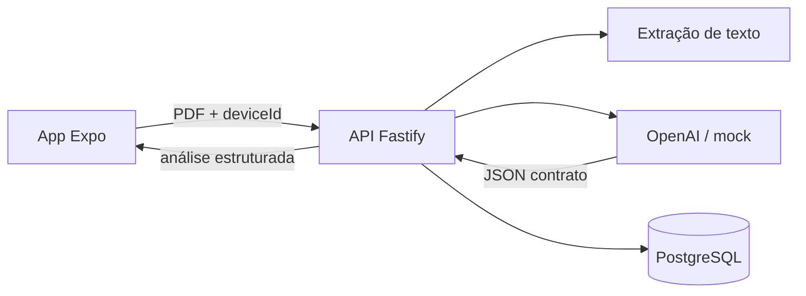

# Arquitetura

LinkUP é um fluxo único. Toda decisão técnica precisa tornar este caminho confiável:

```
Upload → Extração → Análise → Feedback → Histórico
```

## Visão das camadas



| Camada | Responsabilidade | Saída |
| --- | --- | --- |
| Mobile | Upload, estados, resultado, histórico | Fluxo simples em celular |
| API | Validar PDF, orquestrar extração e IA, persistir | Endpoints estáveis |
| Extração | Converter PDF em texto analisável (`unpdf`) | Texto limpo ou erro claro |
| IA | Interpretar o currículo no contrato JSON | Três blocos + dimensões |
| Persistência | Guardar análises e metadados do usuário | Histórico consultável |

## Monorepo

```
apps/mobile     Experiência (Expo + TypeScript)
apps/api        Fastify + Prisma + extração + IA
packages/shared Tipos do contrato (único source of truth)
docs/           Escopo, ADRs, contratos HTTP e prompt
```

Mobile e API **não** inventam o formato do feedback. Os dois importam `@linkup/shared`.

## Autenticação (mínima)

Não há login. O app gera um `deviceId` no primeiro uso e envia o header:

```
X-Device-Id: <uuid>
```

A API cria ou reutiliza o usuário por esse identificador. Ver [ADR 0002](adr/0002-autenticacao-simples.md).

## Endpoints mínimos

Ver contrato completo em [contracts/api.md](contracts/api.md).

| Método | Caminho | Papel |
| --- | --- | --- |
| `GET` | `/health` | Liveness |
| `POST` | `/analyses` | Upload + análise |
| `GET` | `/analyses` | Histórico do device |
| `GET` | `/analyses/:id` | Detalhe |

## Processamento de uma análise

1. Validar `Content-Type`, extensão `.pdf` e tamanho (`MAX_PDF_SIZE_MB`, padrão 5)
2. Extrair texto
3. Se o texto for insuficiente (PDF escaneado, vazio, curto demais), falhar com mensagem clara — não chamar a IA
4. Enviar o texto ao provedor de IA com o prompt versionado
5. Validar o JSON contra o schema de `packages/shared`
6. Persistir `COMPLETED` ou `FAILED`
7. Devolver o recurso para o mobile

Estados internos: `PENDING` → `EXTRACTING` → `ANALYZING` → `COMPLETED` | `FAILED`

## IA

- Prompt canônico: [prompts/resume-analysis.md](prompts/resume-analysis.md)
- Schema: [contracts/analysis-result.schema.json](contracts/analysis-result.schema.json)
- Em desenvolvimento, `AI_PROVIDER=mock` permite o time integrar sem chave
- Em homologação/demo, `AI_PROVIDER=openai`

A API nunca confia no modelo: JSON inválido vira erro controlado, não tela quebrada.

## Dados persistidos por análise

- `id`, `userId`, `fileName`, `fileSizeBytes`
- `status`, `extractedText` (quando houver)
- `resultJson` no contrato compartilhado
- `errorMessage`, `modelUsed`
- `createdAt`, `updatedAt`

Não persistimos o binário do PDF no MVP. O arquivo vive só na requisição.

## Estados obrigatórios no mobile

| Estado | Comportamento |
| --- | --- |
| Inicial | Explica o que fazer e oferece upload |
| Processando | Enviando / analisando |
| Sucesso | Três blocos + atalho para histórico |
| Erro | Linguagem simples + ação possível |
| Histórico vazio | Convite ao primeiro upload |

## Deploy local

PostgreSQL via `docker compose`. API em `localhost:3333`. Mobile via Expo Go ou emulador, apontando para a máquina host.

Resumo da stack: [ADR 0001](adr/0001-stack.md).
